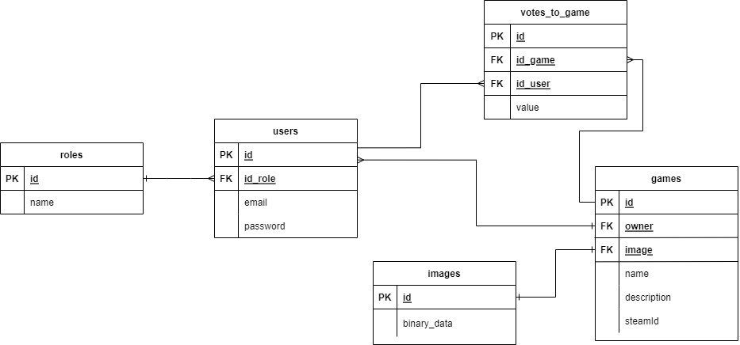
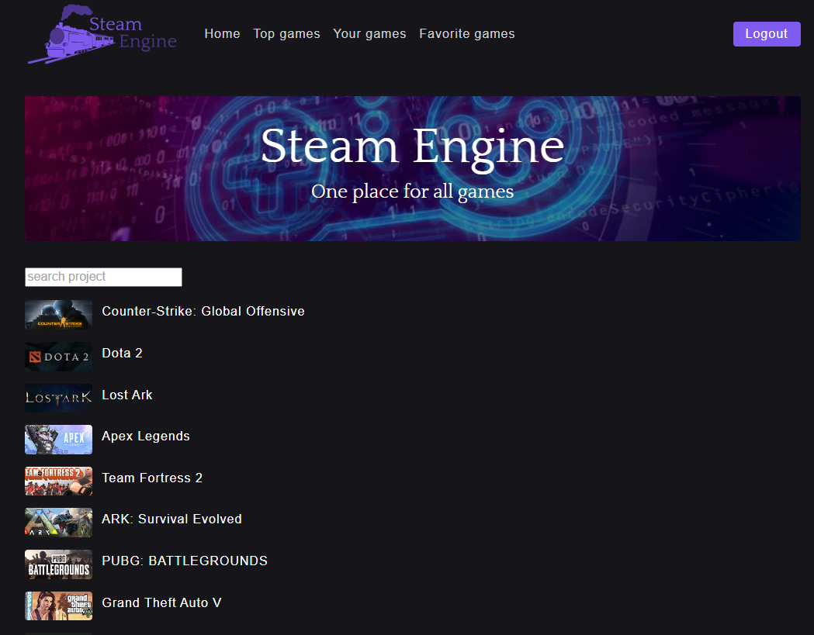
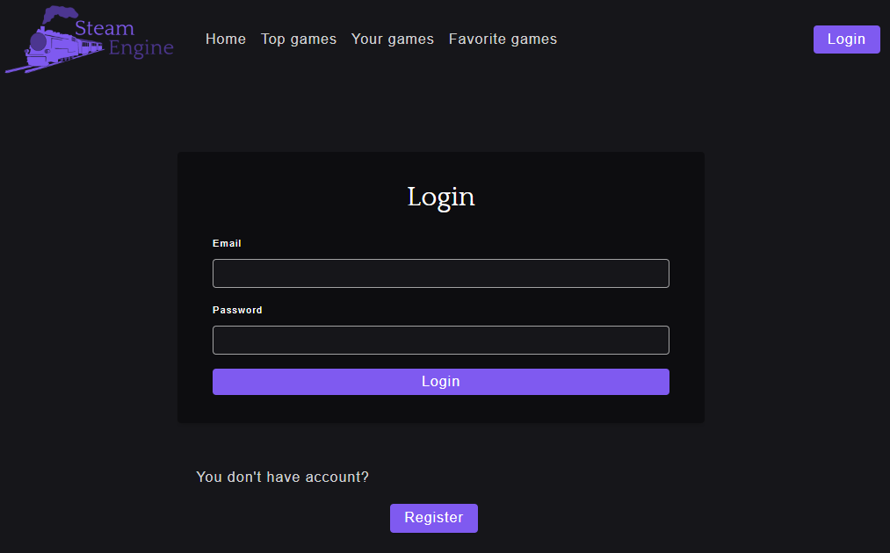
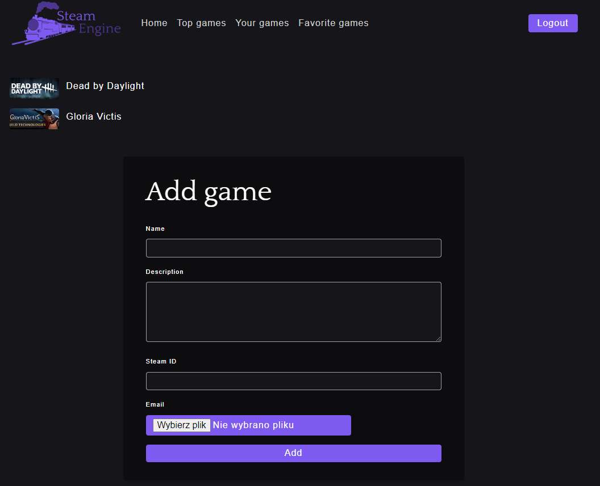
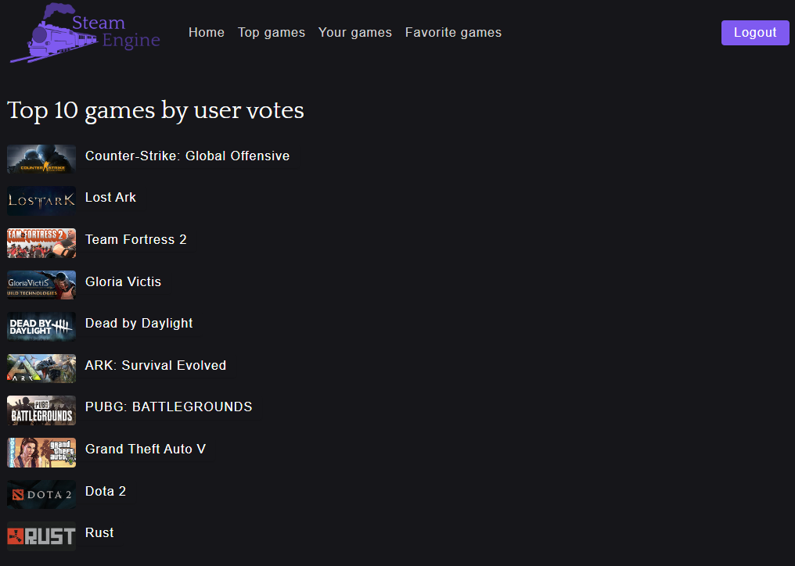

# Steam Engine

> Games library

## Table of Contents
* [General Info](#general-information)
* [Technologies Used](#technologies-used)
* [Features](#features)
* [Screenshots](#screenshots)
* [Setup](#setup)
* [Usage](#usage)
* [Project Status](#project-status)
* [Room for Improvement](#room-for-improvement)
* [Acknowledgements](#acknowledgements)
* [Contact](#contact)

## General Information
Steam Engine is project realized for Projektowanie Aplikacji Internetowych course taken on engineering studies at Cracow University of Technology. Its purpose is to add, browse, search and rate computer games.

## Technologies Used
* PHP 8.1
* HTML 5
* CSS 3
* JavaScript 5
* PostgreSQL

## Features

- Creating user
- Adding games
- Deleting user games
- Listing all games
- Searching given game
- Listing games added by user
- Voting for games
- Listing top games
- Current players count

## Screenshots
ERD

Home 

Login 

Your games

Top 10

## Setup
To run project locally you have to install Docker and run

`docker-compose up`

To configure PostgreSQL you have to set your db credentials in env variables:
DB_USERNAME, PASSWORD, HOST, DATABASE

## Project Status

Project is in _wip_ status

## Room for Improvement

Room for improvement:
- Games list in mobile view needs some polish
- Like/dislike should be done in friendlier way
- Delete needs confirmation

To do:
- Favorite games
- Comments
- Steam integration
- Pagination

## Acknowledgements
- This project was inspired by [steamDB](https://steamdb.info/).
- Used api for ccu: [steamspy](https://steamspy.com/api.php).

## Contact
Created by Konrad Kowalczyk - feel free to contact me!

konrad.kowalczyk@gmail.com
